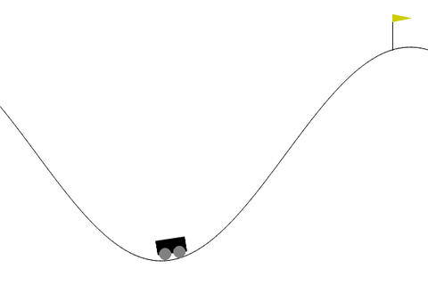
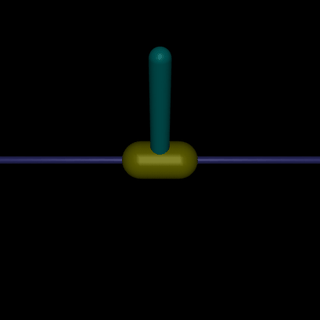
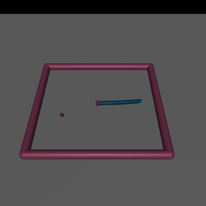
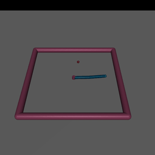
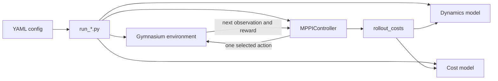

# MPPI Control: Implementation and Experiments

A from-scratch Model Predictive Path Integral (MPPI) controller for continuous
Gymnasium environments. The project currently solves:

- `Pendulum-v1` with analytical PyTorch dynamics.
- `MountainCarContinuous-v0` with analytical PyTorch dynamics.
- `InvertedPendulum-v5` with native batched MuJoCo rollouts.
- `Reacher-v5` with native batched MuJoCo rollouts and vector actions.

The same controller and cost-rollout pipeline is shared by all environments.

## Environment showcases

### Pendulum-v1

Seed 20 demonstrates recovery from roughly `1.382 rad` (`79.2 degrees`) and
finishes upright with return `-120.446`.

[](assets/pendulum_mppi_showcase.mp4)

[Open the full Pendulum MP4](assets/pendulum_mppi_showcase.mp4)

### MountainCarContinuous-v0

Seed 7 builds momentum in both directions and reaches the goal in 167 steps
with return `94.978`.

[](assets/mountain_car_mppi_showcase.mp4)

[Open the full MountainCar MP4](assets/mountain_car_mppi_showcase.mp4)

### InvertedPendulum-v5

The complete seed-11 episode balances for all 1,000 steps with maximum return
`1000`. The 44-second MP4 contains the entire episode at 25 FPS.

[](assets/inverted_pendulum_mppi_showcase.mp4)

[Open the full InvertedPendulum MP4](assets/inverted_pendulum_mppi_showcase.mp4)

### Reacher-v5

The same initial arm state is tested against three fixed target placements.
The close target begins near the fingertip, the far target requires a large
cross-workspace motion, and the upper target tests a different direction.
Click any preview to open its full MP4.

<table>
  <tr>
    <th>Close target</th>
    <th>Far target</th>
    <th>Upper target</th>
  </tr>
  <tr>
    <td><a href="assets/reacher_close_target.mp4"></a></td>
    <td><a href="assets/reacher_far_target.mp4"></a></td>
    <td><a href="assets/reacher_upper_target.mp4"></a></td>
  </tr>
  <tr>
    <td align="center"><code>(0.18, 0.04)</code></td>
    <td align="center"><code>(-0.17, -0.08)</code></td>
    <td align="center"><code>(0.03, 0.16)</code></td>
  </tr>
</table>

## How the code connects

The runner creates one real Gymnasium environment and a separate predictive
model for MPPI. Predictions never advance the real environment.



At each real environment step:

1. `MPPIController.act(observation)` samples `K` noisy action sequences around
   its current nominal plan.
2. `rollout_costs` predicts all candidates for `H` future steps.
3. The cost model assigns running and terminal costs to every trajectory.
4. MPPI converts costs into exponential weights:

   ```text
   weight_k = softmax(-(cost_k - minimum_cost) / temperature)
   ```

5. The nominal plan is updated toward the weighted perturbations.
6. The controller returns its first action, shifts the plan left, and uses the
   remainder as the next step's warm start.

Inside `MPPIController.act`, the implementation is divided into small steps:

| Method | Responsibility |
| --- | --- |
| `_sample_perturbations` | Draw Gaussian exploration noise for all `K` plans. |
| `_build_candidates` | Add noise to the nominal plan and enforce action limits. |
| `rollout_costs` | Ask the dynamics and cost models to score every candidate. |
| `_sampling_cross_term` | Apply the optional MPPI importance-sampling correction. |
| `_compute_weights` | Turn total costs into normalized exponential weights. |
| `_update_nominal_actions` | Move the nominal plan toward low-cost perturbations. |
| `_shift_nominal_actions` | Discard the executed action and warm-start the next step. |

Important tensor shapes are:

```text
current observation       (state_dim,)
candidate actions         (K, H, action_dim)
predicted trajectories    (K, H, state_dim)
trajectory costs          (K,)
MPPI weights              (K,)
```

Effective sample size (ESS) summarizes weight concentration:

```text
ESS = 1 / sum(weights^2)
```

An ESS near `1` means one random candidate dominates. A moderate ESS means
several good candidates contribute, usually producing smoother control.

### Two rollout backends

`rollout_costs` selects the backend from the dynamics object:

| Dynamics interface | Used by | Behavior |
| --- | --- | --- |
| `step(state, action)` | Pendulum, MountainCar | Python loops over the horizon while PyTorch advances all `K` candidates together. Costs are accumulated immediately, so old states need not be stored. |
| `rollout(initial_state, actions)` | InvertedPendulum, Reacher | MuJoCo simulates the full batch in native code and returns `(K, H, state_dim)` states before costs are evaluated. |

MuJoCo returns states *after* each action. The rollout code shifts them so
running costs retain the same timing as the analytical path:

```text
running(s0, u0) + running(s1, u1) + ... + terminal(sH)
```

This shared contract lets the controller remain independent of whether the
physics is analytical or simulator-backed.

Every cost class provides:

```text
running(state, action) -> one cost per state-action pair
terminal(state)        -> one final cost per trajectory
```

MountainCar additionally exposes `terminated(state)` for successful goal
states. InvertedPendulum exposes `failed(state)` so falling is penalized rather
than accidentally treated as desirable early completion.

## Environment design

| Environment | Control problem | Predictive dynamics | Main cost signals |
| --- | --- | --- | --- |
| Pendulum | Swing up and stabilize | Analytical PyTorch equation | Upright angle, angular velocity, torque |
| MountainCarContinuous | Build momentum to climb a hill | Analytical PyTorch equation | Energy deficit, action effort, terminal progress/direction, success bonus |
| InvertedPendulum | Stabilize an unstable pole and center the cart | Batched MuJoCo simulation | Pole angle/velocity, cart position/velocity, force, failure penalty |
| Reacher | Move a two-link fingertip to varying targets | Batched MuJoCo simulation | Fingertip distance, two motor torques, joint velocity, terminal distance |

### Pendulum-v1

The observation is `[cos(theta), sin(theta), theta_dot]` and the action is one
bounded torque. `PendulumDynamics.step` reconstructs the signed angle and uses
Gymnasium's equation of motion with semi-implicit Euler integration: velocity
is updated first, then angle.

The dense cost penalizes:

```text
angle_weight * angle^2
+ velocity_weight * angular_velocity^2
+ action_weight * torque^2
```

There is no success termination; MPPI continuously improves swing-up and
stabilization over the fixed 200-step episode.

### MountainCarContinuous-v0

The state is `[position, velocity]` and the action is a continuous force. The
analytical model exactly follows Gymnasium's update:

```text
next_velocity = velocity + power * force - gravity * cos(3 * position)
next_position = position + next_velocity
```

It also reproduces speed/position clipping and the inelastic left wall. The
main difficulty is that the engine is too weak to drive directly uphill, so
the car must first move away from the goal and build mechanical energy.

A simple distance cost would fight that behavior. The shaped cost therefore
uses energy deficit during the rollout, then terminal position and direction
terms. Reaching the goal produces a success bonus, and successful candidate
trajectories are frozen rather than charged for nonexistent later steps.

### InvertedPendulum-v5

The observation is:

```text
[cart_position, pole_angle, cart_velocity, pole_angular_velocity]
```

The action is one horizontal cart force in `[-3, 3]`. Instead of maintaining a
second hand-derived physics model, `InvertedPendulumMujocoDynamics` shares the
environment's read-only `MjModel` and creates independent `MjData` objects for
its rollout workers. This preserves MuJoCo's masses, inertia, damping,
actuator, constraints, integrator, and joint limits.

Gymnasium applies each action for two MuJoCo steps. The backend repeats every
candidate action twice, simulates all trajectories with a persistent native
thread pool, and keeps every second predicted state.

Gymnasium rewards survival but provides little guidance before failure. MPPI
uses a denser normalized cost:

```text
pole-angle cost
+ pole-angular-velocity cost
+ cart-position cost
+ cart-velocity cost
+ action-effort cost
+ failure penalty when abs(pole_angle) > 0.2
```

Pole terms protect balance, cart terms prevent rail drift, and action effort
discourages aggressive corrections. A stronger terminal cost encourages each
candidate to finish in a stable state. Non-finite observations are also
treated as failures.

### Reacher-v5

Reacher observes the sine and cosine of two joint angles, the target position,
two joint velocities, and the fingertip-to-target vector. Its action contains
two motor torques. `ReacherMujocoDynamics` converts the observation back to a
MuJoCo state, simulates every `(K, H, 2)` candidate action sequence, then
reconstructs all ten observation values for the cost.

The running cost combines Euclidean fingertip distance, squared torque, and an
optional joint-velocity penalty. Terminal distance encourages each short plan
to finish near the target. Reacher has no built-in success termination, so the
runner reports when the fingertip first enters the configured success radius.

## InvertedPendulum benchmark

The tuned configuration uses horizon `15`, `380` samples, temperature `3.0`,
noise sigma `0.15`, and four MuJoCo rollout workers.

| Seed | Outcome | Return | Max angle | Cart RMS | Action RMS | Plan ms | ESS mean/final |
| ---: | --- | ---: | ---: | ---: | ---: | ---: | ---: |
| 7 | survived | 1000.0 | 0.0088 | 0.1677 | 0.022 | 28.58 | 48.6 / 62.5 |
| 8 | survived | 1000.0 | 0.0101 | 0.1411 | 0.022 | 28.32 | 49.1 / 44.1 |
| 9 | survived | 1000.0 | 0.0101 | 0.1124 | 0.022 | 28.98 | 48.3 / 48.7 |
| 10 | survived | 1000.0 | 0.0097 | 0.1666 | 0.022 | 28.48 | 48.1 / 54.6 |
| 11 | survived | 1000.0 | 0.0090 | 0.0810 | 0.022 | 28.45 | 48.7 / 64.7 |

```text
Survival:           5/5 (100%)
Mean return:        1000.0
Worst max angle:    0.0101 rad
Mean pole RMS:      0.0034 rad
Mean cart RMS:      0.1338
Mean planning time: 28.56 ms/step
```

## Setup and running

From PowerShell in the project root:

```powershell
py -3.11 -m venv .venv
.\.venv\Scripts\python.exe -m pip install --upgrade pip
.\.venv\Scripts\python.exe -m pip install -e ".[dev]"
```

| Environment | Run | Record showcase | Configuration |
| --- | --- | --- | --- |
| Pendulum | `scripts/run_pendulum.py` | `scripts/record_pendulum.py` | `configs/pendulum.yaml` |
| MountainCar | `scripts/run_mountain_car_continuous.py` | `scripts/record_mountain_car_continuous.py` | `configs/mountain_car_continuous.yaml` |
| InvertedPendulum | `scripts/run_inverted_pendulum.py` | `scripts/record_inverted_pendulum.py` | `configs/inverted_pendulum.yaml` |
| Reacher | `scripts/run_reacher.py` | `scripts/record_reacher.py` | `configs/reacher.yaml` |

Examples:

```powershell
# Render one configured episode
.\.venv\Scripts\python.exe scripts\run_inverted_pendulum.py

# Evaluate seeds 7 through 11
.\.venv\Scripts\python.exe scripts\run_inverted_pendulum.py `
    --no-render --episodes 5 --seed 7

# Recreate the full seed-11 MP4 and GIF
.\.venv\Scripts\python.exe scripts\record_inverted_pendulum.py

# Recreate all three Reacher MP4 and GIF showcases
.\.venv\Scripts\python.exe scripts\record_reacher.py
```

The other runners support the same `--config`, `--episodes`, `--seed`,
`--device`, `--render`, and `--no-render` pattern.

## Configuration and tuning

Each YAML file separates environment, model, cost, and MPPI settings.

| Setting | Effect |
| --- | --- |
| `horizon` | How far MPPI plans. Longer horizons see farther but increase runtime and search difficulty. |
| `num_samples` | Number of candidate plans. More improves coverage but increases runtime and memory. |
| `temperature` | Higher values spread weight over more candidates; lower values concentrate on the best few. |
| `noise_sigma` | Exploration magnitude. Too little cannot discover corrective actions; too much creates aggressive, unlikely plans. |
| Cost weights | Define the actual control priorities. Relative weights trade task progress, stability, centering, and effort. |
| `terminal_weight` | Importance of the predicted state at the end of the horizon. |
| `sampling_correction` | Enables the fixed-covariance MPPI importance-sampling correction. |

Model constants should normally match Gymnasium. Changing only the predictive
model creates model mismatch with the real environment.

A controlled tuning loop is:

1. Keep the same seed range.
2. Disable rendering for timing comparisons.
3. Change one related group at a time.
4. Compare return/survival, state error, control effort, ESS, and planning time.
5. Validate the selected configuration over multiple seeds.

## Core files

| File | Role |
| --- | --- |
| [`src/mppi_control/controllers/mppi_controller.py`](src/mppi_control/controllers/mppi_controller.py) | Samples perturbations, scores plans, computes MPPI weights, updates/warm-starts the nominal plan, and returns one action. |
| [`src/mppi_control/rollout.py`](src/mppi_control/rollout.py) | Connects controller, dynamics, and cost; dispatches analytical or full-trajectory prediction and returns one cost per sample. |
| [`src/mppi_control/dynamics/`](src/mppi_control/dynamics) | Implements environment prediction through analytical `step` methods or MuJoCo `rollout`. |
| [`src/mppi_control/costs/`](src/mppi_control/costs) | Defines running, terminal, success, and failure objectives used for planning. |
| [`scripts/`](scripts) | Loads YAML, runs evaluation episodes, reports metrics, and records showcases. |
| [`configs/`](configs) | Stores reproducible environment, model, cost, and MPPI parameters. |

Run the test suite with:

```powershell
.\.venv\Scripts\python.exe -m pytest -q
```
