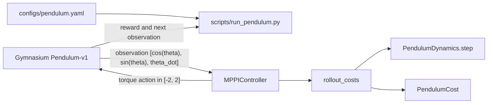

# MPPI Control: Learning, Implementation, and Experiments

A from-scratch implementation and experimental study of Model Predictive Path
Integral (MPPI) control. The current working experiment controls Gymnasium's
`Pendulum-v1` with a vectorized PyTorch dynamics model and an MPPI controller.

## Environment showcases

### Pendulum-v1

This run uses the updated MPPI configuration (`2048` samples and temperature
`1.3`) with seed 20. The pendulum starts about `1.382 rad` (`79.2 degrees`) from
upright, so the recording demonstrates recovery rather than an already-solved
initial state. It finishes at approximately `0.000 rad` with a return of
`-120.446`.

The MP4 plays at 20 FPS to match the model's `0.05 s` timestep and includes
short initial and final holds, producing a roughly 14-second demonstration.
Click the preview to open the full MP4.

[](assets/pendulum_mppi_showcase.mp4)

[Download or open the full Pendulum MP4](assets/pendulum_mppi_showcase.mp4)

## Current status

- `Pendulum-v1` analytical dynamics, running cost, rollout, and MPPI controller
  are implemented.
- `MountainCarContinuous-v0` now has an exact vectorized dynamics model and
  Gymnasium parity tests; its cost, termination-aware rollout, and runner are
  still pending.
- The Pendulum runner supports rendering, repeatable multi-seed experiments,
  CPU/CUDA selection, YAML configuration, and command-line overrides.
- A reproducible MP4 showcase and an animated README preview are
  included under `assets/`.
- The PD baseline, smoke test, evaluation script, and some test files are still
  placeholders.
- MountainCarContinuous, InvertedPendulum, and Reacher are planned future
  environments.

## How the Pendulum experiment works

Gymnasium supplies the real environment. The project does not replace it with a
custom environment. MPPI separately uses an analytical model to predict what
would happen under many possible future action sequences.



At every environment step, the controller:

1. Samples `num_samples` noisy action sequences around its current nominal
   sequence.
2. Predicts every sampled trajectory for `horizon` steps.
3. Calculates running and terminal costs for each trajectory.
4. Converts the trajectory costs into exponential MPPI weights.
5. Updates the nominal sequence toward the lower-cost perturbations.
6. Applies the first action to Gymnasium and shifts the remaining plan forward.

The main tensor shapes are:

```text
observation                 (3,)
environment action          (1,)
nominal action sequence     (horizon, 1)
sampled action sequences    (num_samples, horizon, 1)
trajectory costs            (num_samples,)
```

## Project layout

```text
MPPI-implementation-experiments/
|-- configs/
|   |-- mountain_car_continuous.yaml
|   `-- pendulum.yaml
|-- assets/
|   |-- pendulum_mppi_showcase.gif
|   `-- pendulum_mppi_showcase.mp4
|-- scripts/
|   |-- record_pendulum.py
|   |-- run_pendulum.py
|   `-- smoke_test.py
|-- src/mppi_control/
|   |-- controllers/
|   |   |-- baseline_controller.py
|   |   `-- mppi_controller.py
|   |-- costs/
|   |   `-- pendulum.py
|   |-- dynamics/
|   |   |-- mountain_car_continuous.py
|   |   `-- pendulum.py
|   |-- utils/
|   |   `-- seeding.py
|   `-- rollout.py
|-- tests/
|   |-- test_baseline_controller.py
|   |-- test_mppi_controller.py
|   |-- test_mountain_car_dynamics.py
|   |-- test_pendulum_cost.py
|   |-- test_pendulum_dynamics.py
|   `-- test_rollout.py
|-- pyproject.toml
|-- requirements-lock.txt
`-- README.md
```

### Configuration and scripts

| File | Responsibility |
| --- | --- |
| `configs/pendulum.yaml` | Default environment, model, cost, and MPPI hyperparameters. |
| `scripts/run_pendulum.py` | Loads YAML, applies CLI overrides, creates Gymnasium and MPPI objects, runs episodes, and prints metrics. |
| `scripts/record_pendulum.py` | Runs one reproducible RGB-rendered episode and writes both an MP4 and a compact animated GIF preview. |
| `scripts/smoke_test.py` | Reserved for a minimal Gymnasium installation/API check; currently a placeholder. |

### Source package

| File | Responsibility |
| --- | --- |
| `src/mppi_control/controllers/mppi_controller.py` | Samples perturbations, evaluates candidate plans, computes MPPI weights, updates the nominal action sequence, and returns one bounded action. |
| `src/mppi_control/controllers/baseline_controller.py` | Reserved for a simple PD baseline; currently a placeholder and not used by the runner. |
| `src/mppi_control/dynamics/pendulum.py` | Implements a batched analytical `PendulumDynamics.step(state, action)` that matches Gymnasium's semi-implicit Euler update. |
| `src/mppi_control/dynamics/mountain_car_continuous.py` | Implements the batched MountainCar transition, including force/speed/position clipping and the left-wall collision rule. |
| `src/mppi_control/costs/pendulum.py` | Implements the configurable Pendulum running and terminal costs. |
| `src/mppi_control/rollout.py` | Rolls all candidate action sequences through the dynamics model and returns one total cost per sample. |
| `src/mppi_control/utils/seeding.py` | Reserved for shared seeding helpers; currently a placeholder. The active runner currently seeds Python, NumPy, PyTorch, Gymnasium, and MPPI itself. |
| `__init__.py` files | Mark directories as importable Python packages and optionally expose public classes. |

### Tests and packaging

| File | Responsibility |
| --- | --- |
| `tests/test_mppi_controller.py` | Tests action bounds and dtype, deterministic sampling, controller reset, MPPI weights, and parameter validation. |
| `tests/test_mountain_car_dynamics.py` | Verifies shapes, parameter validation, clipping, left-wall behavior, and one-step/multi-step equality with Gymnasium. |
| `tests/test_pendulum_dynamics.py` | Reserved for analytical-dynamics tests; currently a placeholder. |
| `tests/test_pendulum_cost.py` | Reserved for cost tests; currently a placeholder. |
| `tests/test_rollout.py` | Reserved for rollout tests; currently a placeholder. |
| `tests/test_baseline_controller.py` | Reserved for PD-controller tests; currently a placeholder. |
| `pyproject.toml` | Defines package metadata, runtime/development dependencies, `src/` package discovery, pytest, and coverage settings. |
| `requirements-lock.txt` | Records the exact packages from the development environment, including the CUDA-specific PyTorch build. |

## Setup

The project currently targets Python 3.11 or newer. From PowerShell in the
project root:

```powershell
py -3.11 -m venv .venv
.\.venv\Scripts\python.exe -m pip install --upgrade pip
.\.venv\Scripts\python.exe -m pip install -e ".[dev]"
```

The editable install makes `mppi_control` importable while allowing changes
under `src/` to take effect without reinstalling the project.

The exact `torch==...+cu...` entry in `requirements-lock.txt` may require the
matching PyTorch CUDA package index. The normal editable install is sufficient
for a CPU installation; follow the official PyTorch installer command when a
specific CUDA build is required.

## Running Pendulum

All commands below assume PowerShell is in the project root.

Run one episode with the YAML defaults. The current configuration opens a human
rendering window:

```powershell
.\.venv\Scripts\python.exe scripts\run_pendulum.py
```

Run without rendering:

```powershell
.\.venv\Scripts\python.exe scripts\run_pendulum.py --no-render
```

Run 20 reproducible episodes with seeds 7 through 26:

```powershell
.\.venv\Scripts\python.exe scripts\run_pendulum.py --no-render --episodes 20 --seed 7
```

Use CUDA, or select CUDA automatically when available:

```powershell
.\.venv\Scripts\python.exe scripts\run_pendulum.py --device cuda
.\.venv\Scripts\python.exe scripts\run_pendulum.py --device auto
```

Use a separate experiment configuration:

```powershell
.\.venv\Scripts\python.exe scripts\run_pendulum.py --config configs\pendulum_experiment.yaml --no-render
```

Display every command-line option:

```powershell
.\.venv\Scripts\python.exe scripts\run_pendulum.py --help
```

Command-line values for `--episodes`, `--seed`, `--device`, `--render`, and
`--no-render` override the corresponding YAML values without modifying the
configuration file.

### Recording the Pendulum showcase

Regenerate both files after changing the controller or hyperparameters. The
recording script defaults to the documented seed 20 and showcase paths:

```powershell
.\.venv\Scripts\python.exe scripts\record_pendulum.py `
    --seed 20 `
    --output assets\pendulum_mppi_showcase.mp4 `
    --preview assets\pendulum_mppi_showcase.gif
```

Choose another seed or output location:

```powershell
.\.venv\Scripts\python.exe scripts\record_pendulum.py `
    --seed 12 `
    --output assets\pendulum_mppi_seed12.mp4 `
    --preview assets\pendulum_mppi_seed12.gif
```

## Reading the output

Example:

```text
Episode   1/20 | seed=7 | steps=200 | return=-123.502 | final_angle=-0.053 rad | final_velocity=-0.180 rad/s | ESS=1.5
Mean return: -164.189 | Std: 68.084
```

- `return`: sum of the 200 Gymnasium rewards. Rewards are non-positive, so a
  value closer to zero is better. Different initial states have different
  difficulty, so compare controllers across the same seeds.
- `final_angle`: signed distance from upright in radians. Zero is upright.
- `final_velocity`: final angular velocity in radians per second. Zero is
  stationary.
- `ESS`: effective sample size from the final MPPI update. It lies between
  approximately 1 and `num_samples`. A very low value means only a few sampled
  trajectories dominated that update.
- `Std`: standard deviation of returns. It is zero for a single episode and is
  only meaningful across multiple seeds.

The current runner reports the final step's ESS, not an episode-wide average.

## Changing hyperparameters

Edit `configs/pendulum.yaml`, or copy it to a new file and pass the copy with
`--config`. Keeping separate files makes experiments reproducible:

```powershell
Copy-Item configs\pendulum.yaml configs\pendulum_horizon_60.yaml
```

Then edit `configs\pendulum_horizon_60.yaml` and run:

```powershell
.\.venv\Scripts\python.exe scripts\run_pendulum.py --config configs\pendulum_horizon_60.yaml --no-render --episodes 20
```

### General settings

| Setting | Meaning |
| --- | --- |
| `seed` | Base seed. Episode `i` uses `seed + i`, making repeated experiments reproducible. |
| `device` | MPPI planning device: `cpu`, `cuda`, or `auto`. |
| `environment.id` | Gymnasium environment ID. The current analytical model is specifically for `Pendulum-v1`. |
| `environment.render_mode` | Use `human` for a window or `null` for no rendering. CLI render flags can override it. |
| `environment.episodes` | Number of episodes when `--episodes` is not provided. |

### Dynamics-model parameters

| Setting | Current value | Meaning |
| --- | ---: | --- |
| `model.gravity` | `10.0` | Gravitational acceleration used by the predictive model. |
| `model.mass` | `1.0` | Pendulum mass. |
| `model.length` | `1.0` | Pendulum length. |
| `model.dt` | `0.05` | Simulation timestep in seconds. |
| `model.max_torque` | `2.0` | Torque limit used by the model. |
| `model.max_speed` | `8.0` | Angular-speed limit used by the model. |

These values match Gymnasium `Pendulum-v1`. Changing only these YAML values
changes MPPI's internal model but does not change the real Gymnasium
environment. That intentionally or accidentally creates model mismatch. Leave
them unchanged while validating the standard environment.

### Cost parameters

The running cost is:

```text
angle_weight * angle^2
+ velocity_weight * angular_velocity^2
+ action_weight * torque^2
```

| Setting | Effect of increasing it |
| --- | --- |
| `cost.angle_weight` | Prioritizes reaching and remaining upright. |
| `cost.velocity_weight` | Penalizes fast motion and encourages settling. Too much can discourage the swing-up motion. |
| `cost.action_weight` | Penalizes control effort. Too much can prevent aggressive swing-up. |
| `cost.terminal_weight` | Places additional importance on the state at the end of the planning horizon. The current value `0.0` disables terminal cost. |

The current running weights `1.0`, `0.1`, and `0.001` match Gymnasium's reward
definition.

### MPPI parameters

| Setting | Effect and trade-off |
| --- | --- |
| `mppi.horizon` | Number of predicted control steps. Larger values see farther ahead but increase runtime approximately linearly. At `40` with `dt=0.05`, the controller plans 2 seconds ahead. |
| `mppi.num_samples` | Number of candidate trajectories per iteration. More samples improve search coverage but increase runtime and memory approximately linearly. |
| `mppi.temperature` | Controls how concentrated the exponential weights are. Lower values focus strongly on the best few samples; higher values spread influence over more samples and often increase ESS. |
| `mppi.noise_sigma` | Standard deviation of sampled torque perturbations. Larger values explore more aggressively but can cause more actions to hit the torque limits. |
| `mppi.num_iterations` | Optional number of MPPI updates per environment step. The runner uses `1` when omitted. More iterations cost proportionally more. |
| `mppi.sampling_correction` | Optional Boolean controlling the fixed-covariance MPPI importance-sampling correction. The runner uses `true` when omitted. |

The approximate planning workload per episode scales as:

```text
environment steps * horizon * num_samples * num_iterations
```

For the current configuration, that is approximately:

```text
200 * 40 * 1024 * 1 = 8,192,000 predicted state transitions
```

Optional parameters can be added directly to the YAML:

```yaml
mppi:
  horizon: 40
  num_samples: 1024
  temperature: 1.0
  noise_sigma: 1.0
  num_iterations: 1
  sampling_correction: true
```

## A controlled tuning workflow

1. Keep the same seed range for every configuration.
2. Disable rendering while benchmarking.
3. Change one hyperparameter at a time.
4. Compare mean and median return, standard deviation, final state, runtime,
   and ESS.
5. Repeat promising settings over at least 50 to 100 seeds.

For the currently observed low final-step ESS, `temperature` is the first
parameter to investigate. Test several values with identical seeds instead of
assuming that a higher value is automatically better. `noise_sigma`, horizon,
and the cost weights also influence the spread of trajectory costs.

Example comparison:

```text
configs/pendulum_temperature_1.yaml
configs/pendulum_temperature_2.yaml
configs/pendulum_temperature_5.yaml
```

Run each one with the same command except for `--config`:

```powershell
.\.venv\Scripts\python.exe scripts\run_pendulum.py --config configs\pendulum_temperature_1.yaml --no-render --episodes 20 --seed 7
```

## Running tests

Run all existing tests:

```powershell
.\.venv\Scripts\python.exe -m pytest -q
```

Run only the implemented MPPI controller tests:

```powershell
.\.venv\Scripts\python.exe -m pytest tests\test_mppi_controller.py -v
```

## Project goals

- Implement and understand MPPI from scratch.
- Validate analytical dynamics against Gymnasium.
- Study hyperparameters, sampling behavior, performance, and runtime.
- Reproduce experiments across fixed seed sets.
- Add MountainCarContinuous, MuJoCo InvertedPendulum, and Reacher experiments.
