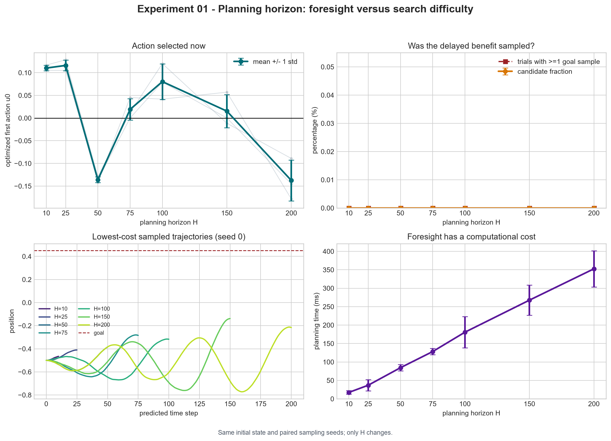
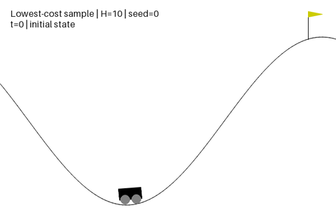

# Experiment 01: Planning Horizon and Foresight

## Experiment

This experiment asks whether increasing MPPI's planning horizon can change the
action selected now.

Mountain Car must often move left, away from the goal, before reversing and
using the accumulated momentum to climb the right hill. A short horizon may
see only the immediate increase in distance and therefore prefer a positive
action. A longer horizon may see enough of the maneuver to prefer an initially
negative action.

The experiment starts from `position=-0.5, velocity=0` and compares
`H = [10, 25, 50, 75, 100, 150, 200]`. All other MPPI parameters remain fixed:
`K=8192`, `lambda=1`, `sigma=0.5`, and one update from a zero nominal plan.
Three paired sampling seeds are used.

The cost contains terminal distance, a terminal wrong-direction penalty,
action effort, and a success bonus. It deliberately contains no energy or
momentum shaping, so momentum-building behavior must become useful through the
planning horizon itself.

## Results

- `H=10` and `H=25` selected positive first actions, as expected from the
  short-term distance objective.
- `H=50` selected a negative first action. Its lowest-cost trajectory first
  moved left and then reversed toward the goal.
- The change was not monotonic. The mean action became positive or nearly zero
  again at `H=75`, `H=100`, and `H=150`, then became negative at `H=200`.
- No sampled trajectory reached the goal at any tested horizon. The action
  changes therefore came from differences in terminal-state quality rather
  than from the success bonus.
- Longer horizons were harder to search. Mean effective sample size fell from
  about `6509` at `H=10` to `56` at `H=200`.
- Mean planning time increased from about `17 ms` at `H=10` to `353 ms` at
  `H=200`.

## Representative Trajectories

<table>
  <tr>
    <th>H=10: short-term movement</th>
    <th>H=50: left-then-right maneuver</th>
  </tr>
  <tr>
    <td></td>
    <td></td>
  </tr>
</table>

H=100 and H=200 recordings

- `H=100`: [GIF](media/best_candidate_h100_seed000.gif) / [MP4](media/best_candidate_h100_seed000.mp4)
- `H=200`: [GIF](media/best_candidate_h200_seed000.gif) / [MP4](media/best_candidate_h200_seed000.mp4)

## Conclusion

The pilot shows that the planning horizon can change MPPI's current action and
can make an initial movement away from the goal desirable. However, more
foresight did not produce a simple monotonic improvement. As the horizon grew,
the search space became harder to sample, the effective sample size decreased,
and no candidate completed the task. The experiment therefore demonstrates
both sides of increasing the horizon: greater foresight and greater search
difficulty.
