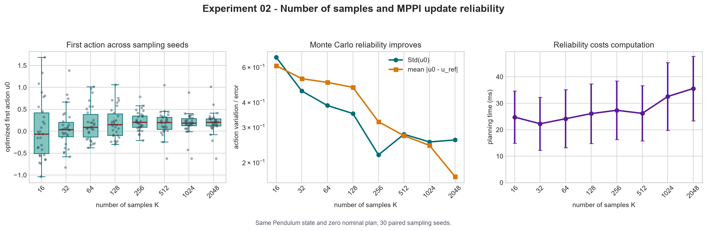

# Experiment 02: Number of Samples and Update Reliability

## Experiment

This experiment asks how the number of sampled trajectories, `K`, affects the
reliability of one MPPI update.

The Pendulum planning problem is kept identical in every trial. The initial
state is `theta=pi/2, theta_dot=0`, represented by `[0, 1, 0]`, and the nominal
action sequence is reset to zero. The experiment compares
`K = [16, 32, 64, 128, 256, 512, 1024, 2048]` with `H=40`, `lambda=1`, and
`sigma=1`.

For each `K`, the same planning problem is solved using 30 sampling seeds. For
a given seed, every larger population contains the samples used by the smaller
population plus additional candidates. A paired `K=3000` solution is used as
the higher-sample reference.

If increasing `K` improves Monte Carlo coverage, the selected first action
should vary less across seeds and move closer to the paired reference action.

## Results

- The standard deviation of the first action decreased overall from `0.669`
  at `K=16` to `0.259` at `K=2048`, a reduction of about 61%.
- The decrease in variability was not perfectly monotonic. It reached `0.218`
  at `K=256` and fluctuated slightly at larger sample counts.
- Mean absolute error relative to the paired `K=3000` reference decreased at
  every tested step, from `0.608` at `K=16` to `0.169` at `K=2048`.
- The mean first action moved from `0.034` at `K=16` toward the reference mean
  of `0.190`, reaching `0.196` at `K=2048`.
- Planning time increased modestly from about `25 ms` at `K=16` to `36 ms` at
  `K=2048`. For small populations, fixed Python and rollout overhead was large
  relative to the sampling work.
- Larger populations reduced sampling variability but did not eliminate it;
  occasional outlying actions remained even at high `K`.

## Conclusion

Increasing `K` made the MPPI update more reliable. The clearest evidence is
the steady reduction in error relative to the paired higher-sample reference.
Action variability also decreased substantially overall, although finite-seed
fluctuations made the trend non-monotonic.

The improvement showed diminishing returns: larger populations continued to
help, but each increase required more computation for a progressively smaller
gain in reliability. `K` therefore controls a tradeoff between Monte Carlo
coverage and planning cost.
