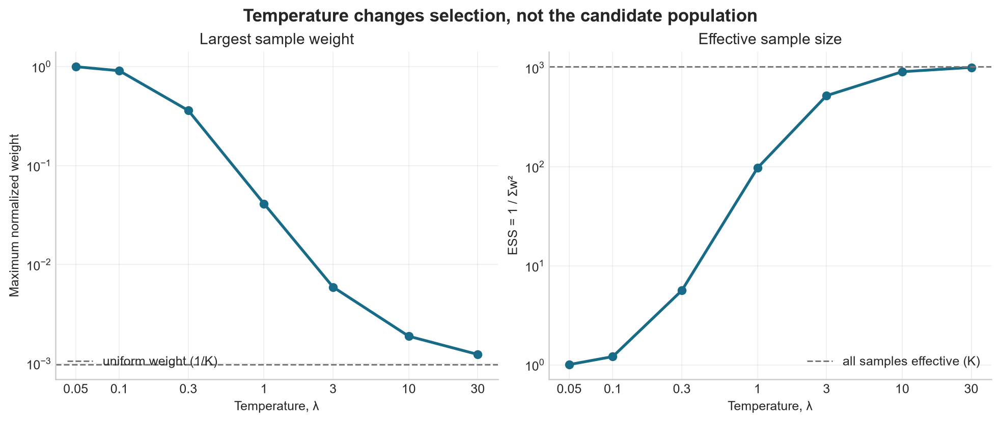

# Experiment 03: Temperature and Weight Concentration

## Experiment

This experiment isolates how the MPPI temperature, `lambda`, changes the
selection of sampled trajectories.

One Pendulum candidate population is generated from the initial state
`theta=pi/2, theta_dot=0`, represented by `[0, 1, 0]`. It contains `K=1024`
trajectories with `H=40`, a zero nominal action sequence, and `sigma=1`.
The resulting costs are frozen and reused for
`lambda = [0.05, 0.1, 0.3, 1, 3, 10, 30]`; no trajectories are regenerated.

For each temperature, the normalized MPPI weights are computed as
`w_k proportional to exp(-(S_k - S_min) / lambda)`. Selection concentration
is measured using the largest weight and the effective sample size,
`ESS = 1 / sum(w_k^2)`. ESS ranges from `1` when one candidate dominates to
`K` when all candidates have equal weight.

## Results

- At `lambda=0.05`, the best trajectory received `0.997` of the total weight
  and ESS was `1.01`. The update was effectively determined by one sample.
- At `lambda=0.3`, the largest weight fell to `0.360` and ESS increased to
  `5.63`, so selection remained highly concentrated.
- At `lambda=1`, the largest weight was `0.0412` and ESS was `97.2`.
- At `lambda=3`, ESS increased to `522`, approximately half of the population.
- At `lambda=30`, the largest weight was `0.00124`, close to the uniform value
  `1/K = 0.000977`, and ESS reached `1007` out of `1024` (`98.3%`).
- Maximum weight decreased and ESS increased at every tested temperature.

## Conclusion

Temperature controls how aggressively MPPI selects among trajectories that
have already been sampled. Low temperature behaves almost like choosing the
single lowest-cost candidate, while high temperature averages information
from most of the population.

This role is different from `sigma`: `sigma` controls where candidate actions
are sampled, whereas `lambda` controls how strongly their costs influence the
update after sampling.
