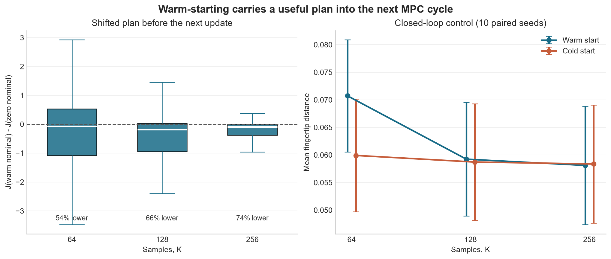

# Experiment 04: Warm-Starting Across MPC Cycles

## Experiment

This experiment asks whether shifting the unexecuted part of an optimized MPPI
plan preserves useful information for the next MPC cycle.

The existing `Reacher-v5` dynamics, cost, and controller configuration are
used with `H=16`, `lambda=1`, `sigma=0.16`, and one MPPI update per control
step. The sample count is varied over `K = [64, 128, 256]`. Each configuration
uses the same ten paired environment and sampling seeds and runs for 100 steps.

After the warm controller optimizes a plan and executes its first action, the
remaining sequence is shifted left and padded with zero. From the resulting
next state, before another MPPI update, this shifted nominal and an all-zero
nominal are evaluated using the same model and cost. This gives 990 paired
pre-update comparisons for each `K`.

Full closed-loop episodes are then compared. The warm controller retains the
shifted sequence, while the cold controller clears its nominal sequence before
every update. All other settings remain identical.

## Results

- The shifted nominal had lower predicted cost than the zero nominal in `54%`
  of comparisons at `K=64`, `66%` at `K=128`, and `74%` at `K=256`.
- The mean paired cost differences, `J_shifted - J_zero`, were `-0.376`,
  `-0.449`, and `-0.384`, respectively. Negative values favor the shifted
  plan, but the distributions also contain cases where shifting was worse.
- At `K=64`, warm starting did not improve closed-loop control. Mean fingertip
  distance was `0.0707` for warm start versus `0.0599` for cold start, and the
  success rates were `50%` and `70%`, respectively.
- At `K=128`, mean distance was nearly tied (`0.0592` warm versus `0.0587`
  cold), with a `70%` success rate for both.
- At `K=256`, the controllers were effectively indistinguishable: mean
  distance was `0.0581` warm versus `0.0584` cold, and both reached `70%`
  success.
- Mean returns followed the same pattern. Warm/cold returns were
  `-10.70/-6.15` at `K=64`, `-7.25/-5.93` at `K=128`, and
  `-5.83/-5.83` at `K=256`.

## Conclusion

Warm-starting often preserved a nominal sequence with lower predicted cost,
confirming that the shifted plan can carry optimization information into the
next cycle. It was not guaranteed to do so on every transition.

That retained information did not automatically improve the full controller.
At the smallest sampling budget, warm starting was worse than rebuilding from
zero; this is consistent with a shifted initialization also being able to
carry an imperfect plan forward. As `K` increased, the warm and cold
controllers converged to nearly identical performance. Warm-starting is
therefore an initialization mechanism, not a guarantee of a better plan.
