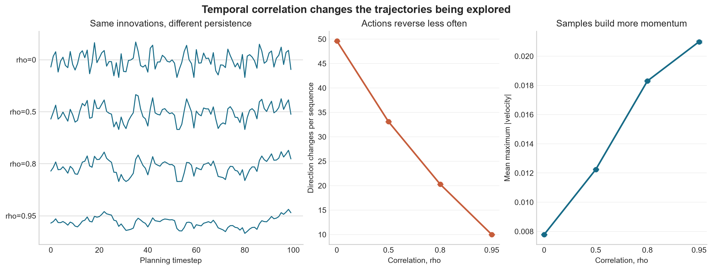

# Experiment 05: IID Versus Temporally Correlated Noise

## Experiment

This experiment asks how positive correlation between neighboring action
perturbations changes the trajectories explored by MPPI.

The existing `MountainCarContinuous-v0` dynamics and energy-shaped cost are
used from the fixed state `[-0.5, 0]`. Each population contains `K=1024`
candidate sequences with `H=100`, `sigma=0.5`, and a zero nominal plan.
Correlation is varied over `rho = [0, 0.5, 0.8, 0.95]` using

`epsilon_t = rho*epsilon_(t-1) + sqrt(1-rho^2)*sigma*z_t`.

The initial perturbation is sampled from the stationary distribution. Twenty
innovation seeds are used, and every `rho` receives the same Gaussian
innovations for paired comparison. Candidate actions are clipped to the
environment bounds before rollout.

The experiment inspects the proposal population before MPPI weighting. It
measures lag-one correlation, action-direction changes, same-direction run
length, and the maximum absolute velocity produced by each trajectory.

## Results

- The observed lag-one correlations were `-0.001`, `0.499`, `0.799`, and
  `0.950`, closely matching the requested values.
- Marginal noise standard deviation remained approximately `0.5` for every
  configuration. The experiment therefore changed temporal structure without
  changing the one-step exploration scale.
- Mean direction changes per 100-step sequence fell from `49.6` at `rho=0`
  to `10.0` at `rho=0.95`, a reduction of about 80%.
- Mean same-direction run length increased from `2.00` to `12.55` steps.
- Mean maximum absolute velocity increased monotonically from `0.00779` to
  `0.02099`, approximately 2.7 times the IID value.
- The 90th percentile of maximum absolute velocity increased from `0.0116` to
  `0.0334`, showing that the higher-momentum tail improved as well.
- Mean energy-shaped rollout cost decreased from `107.8` for IID noise to
  `92.6` at `rho=0.95`. This describes the sampled population, not yet the
  performance of a complete correlated-noise MPPI controller.

## Conclusion

Positive temporal correlation produced smoother, more persistent action
sequences without increasing their marginal standard deviation. In
MountainCar, those sustained forces cancelled less through the dynamics and
built substantially more momentum than IID perturbations.

The effect is not universally beneficial. Strong correlation also removes
many rapid action reversals from the proposal population, so it can make tasks
requiring abrupt changes harder to explore. Experiment 06 will test whether
the improved proposal structure translates into better use of a fixed rollout
budget.
