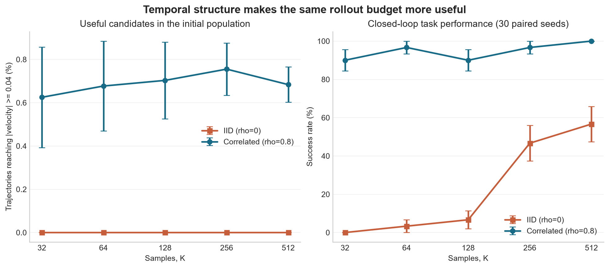

# Experiment 06: Sampling Efficiency From Correlated Noise

## Experiment

This experiment asks whether temporally correlated noise uses a fixed MPPI
rollout budget more effectively than IID noise.

The existing `MountainCarContinuous-v0` dynamics and energy-shaped cost are
used from the fixed state `[-0.5, 0]`. IID sampling (`rho=0`) is compared with
moderate AR(1) correlation (`rho=0.8`) across
`K = [32, 64, 128, 256, 512]`. Every controller uses `H=100`, `sigma=0.5`,
`lambda=1`, one MPPI update per control step, and the appropriate covariance
in the sampling-correction term.

The final study uses 30 paired sampling seeds. A one-seed pilot showed that the
default 999-step environment limit allowed every configuration to eventually
succeed, so task success is evaluated using a fixed 150-step control budget.

Before the final sweep, a useful initial candidate was defined as a trajectory
reaching `max(abs(velocity)) >= 0.04` within its planning horizon. Candidate
populations are nested across `K`, and IID and correlated populations reuse the
same underlying Gaussian innovations.

## Results

- No IID candidate reached the predefined useful-velocity threshold in any
  tested initial population. With `rho=0.8`, approximately `0.6-0.8%` of
  candidates were useful at every `K`.
- The probability that a correlated population contained at least one useful
  candidate increased from `20%` at `K=32` to `93%` at `K=512`. It remained
  `0%` for all IID populations in this study.
- At `K=32`, success increased from `0%` with IID noise to `90%` with
  correlated noise.
- At `K=64`, success was `3.3%` for IID and `96.7%` for correlated noise. At
  `K=128`, it was `6.7%` and `90%`, respectively.
- Larger IID populations improved performance, reaching `46.7%` success at
  `K=256` and `56.7%` at `K=512`. Correlated sampling reached `96.7%` and
  `100%` at those budgets.
- Correlated MPPI with `K=32` therefore outperformed IID MPPI with `K=512`
  despite using sixteen times fewer trajectories per update.
- Mean episode length, including 150-step timeouts, was `103.8` steps for
  correlated `K=32` versus `137.0` steps for IID `K=512`.

## Conclusion

Moderate temporal correlation placed a larger fraction of the rollout budget
in momentum-building trajectories. That proposal structure translated into a
large closed-loop advantage: the correlated controller achieved higher success
with the smallest population than IID sampling achieved with the largest.

Increasing `K` helped IID sampling, but it did not compensate for an unsuitable
temporal proposal within the tested range. This demonstrates the distinction
between more samples and better-structured samples: sample count controls how
thoroughly a proposal is explored, while correlation changes which action
sequences the proposal makes likely.
