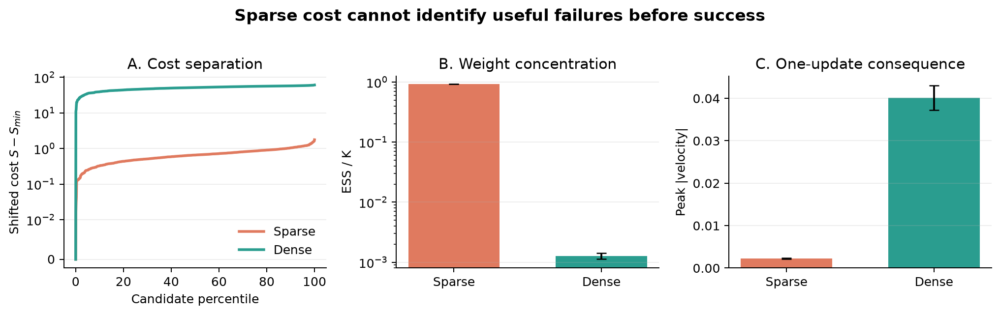

# Experiment 07: Sparse Versus Dense Cost

## Experiment

This experiment asks whether MPPI can rank useful trajectories before any
sample completes the task. The same candidate action sequences are scored by:

- a sparse cost: `0.05 * sum(u^2) - 100 * goal_reached`;
- the existing dense energy-shaped Mountain Car cost.

The comparison uses `MountainCarContinuous-v0` from the fixed state
`[-0.5, 0]`, with `H=100`, `K=1024`, `sigma=0.5`, `rho=0.8`, and `lambda=1`.
The final study contains 30 paired seeds. Only the cost changes: both
conditions see exactly the same 30,720 candidate trajectories and begin from a
zero nominal plan.

## Results

- None of the 30,720 candidates reached the goal. The sparse cost therefore
  ranked every trajectory only by action effort; it received no information
  from the success bonus.
- Mean candidate-cost standard deviation was `0.283` for the sparse cost and
  `7.73` for the dense cost. Mean cost range was `1.84` versus `50.5`.
- Sparse-cost ESS was `955.4 / 1024` (`93.3%`), so its weights remained close
  to uniform. Dense-cost ESS was `1.31 / 1024` (`0.128%`).
- The sparse cost assigned only `7.3%` of total weight to the top `10%` of
  momentum-building candidates. The dense cost assigned more than `99.99%`.
- Cost and peak velocity had mean Spearman correlation `+0.498` for sparse and
  `-0.840` for dense. Because lower cost is preferred, the sparse objective
  actively favored lower-momentum samples, while the dense objective favored
  higher-momentum samples.
- After one MPPI update, the weighted sparse plan reached mean peak absolute
  velocity `0.00224`; the dense plan reached `0.0401`, approximately `18x`
  larger.

## Conclusion

Before success occurs, a success-only objective cannot tell MPPI which failed
trajectories are useful. Its action penalty can even prefer doing less over
building the momentum required for later success. The dense cost supplies an
intermediate progress signal, allowing MPPI to identify and combine promising
failures.

This does not mean that every dense cost is automatically well tuned. At
`lambda=1`, the dense objective concentrated almost all weight on one or two
samples. Its ranking was useful here, but the very low ESS indicates that cost
scale and temperature should be calibrated together.
