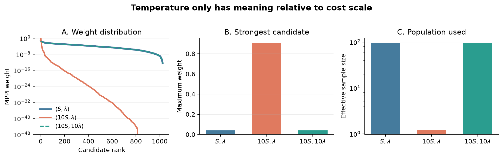

# Experiment 08: Cost Scale and Temperature

## Experiment

This experiment asks whether multiplying every trajectory cost by the same
positive constant changes MPPI when the trajectory ordering stays unchanged.
Weights depend on the ratio `S/lambda`, so cost scale and temperature must be
considered together.

Experiment 03's Pendulum candidate-cost vector was reconstructed exactly from
its documented fixed setup: `seed=7`, `K=1024`, `H=40`, `sigma=1`, a zero
nominal plan, and initial observation `[0, 1, 0]`. The reconstruction reproduces
Experiment 03's `lambda=1` maximum weight and ESS. This one cost vector is then
reused without generating new trajectories for:

- `(S, lambda)`;
- `(10S, lambda)`;
- `(10S, 10lambda)`.

## Results

- In the original `(S, lambda)` case, maximum weight was `0.04121` and ESS was
  `97.19 / 1024`.
- Scaling only the costs to `(10S, lambda)` raised maximum weight to `0.90766`
  and reduced ESS to `1.21`. Although candidate ordering did not change, the
  update became almost a single-sample selection.
- Scaling both quantities to `(10S, 10lambda)` recovered maximum weight
  `0.04121` and ESS `97.19`.
- The largest absolute difference between any original and recovered weight
  was `3.73e-7`, below the predefined float32 tolerance of `1e-6`.

## Conclusion

The numerical scale of a cost function changes MPPI's behavior when
temperature is held fixed. Multiplying costs by ten is equivalent to making
selection ten times more aggressive.

When costs and temperature are scaled together, their ratio is preserved and
the original weights return up to floating-point precision. Therefore,
`lambda` is meaningful only relative to the scale of the trajectory costs.
